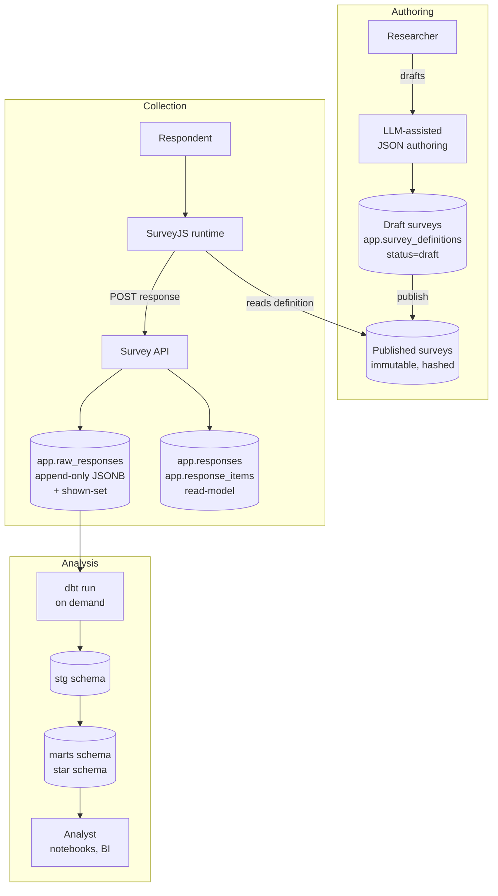
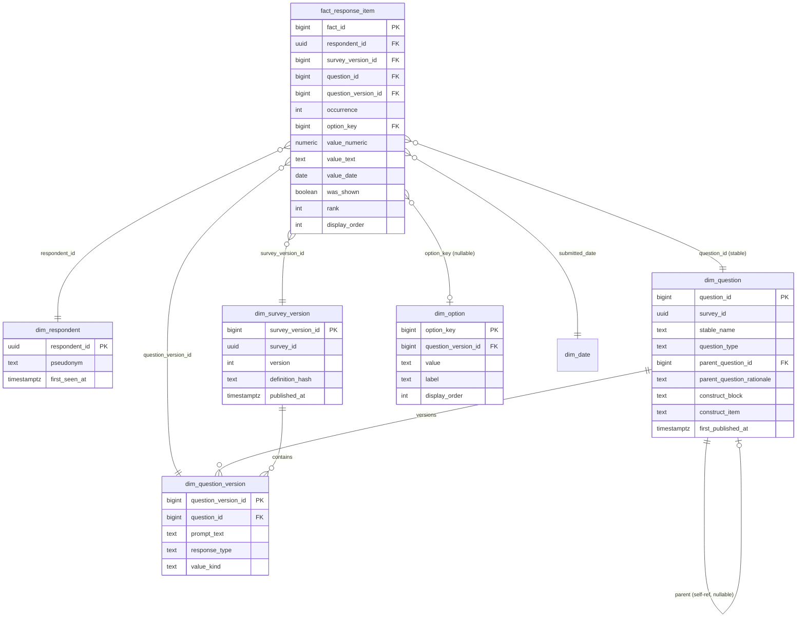
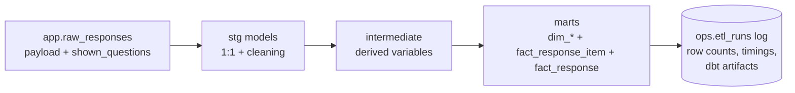

# Survey Engine and Data Warehouse — Engineering Design Document

**Status:** Living — reconciled with the as-built system (M0–M6 complete)
**Author:** *(to fill)*
**Last updated:** 2026-05-25
**Version:** 3

> This is the maintained design document. The original pre-build design — plus the
> incremental syncs made during M0–M6 — is frozen at
> [`docs/design/archive/survey-engine-design-doc.v1.md`](docs/design/archive/survey-engine-design-doc.v1.md).

### Changelog

**v3 (2026-05-25)** — corrected the cross-version equivalence model (§3.5, §6) after an audit found the warehouse keyed `question_id` on `stable_name` alone:

- **Bug fixed in the build:** `question_id` now keys on `(survey_id, stable_name)`, not `stable_name` alone. The old key silently pooled any questions sharing a name — across versions *and across unrelated surveys* (two surveys' `q1` collapsed into one id) — violating invariant 5. `dim_question` gains a `survey_id` column; a `question_id_survey_scoped` test pins the key.
- **§3.5 / §6** — corrected the claim that `GROUP BY question_id` gives "strict per-version" behavior (it pools a survey's versions of a same-named question; strict per-version is `GROUP BY question_version_id`). Documented the survey-scoped identity and what it does/doesn't bridge (versions yes by name, renames/instruments only via the opt-in `canonical_question_id`).

**v2 (2026-05-25)** — reconciled the document with the system as actually built across milestones M0–M6. The architecture held; the changes are factual corrections where the build added detail the original design left open:

- **§3.3 Schema layout** — added the `ops` schema (operational ETL metadata, introduced with the run log in §3.7). Corrected the ETL role's read scope: it reads the *declared dbt sources* — `app.raw_responses` plus the non-content `pii.free_text_review_decisions` (reviewer promote/reject decisions, no PII text) — not `app` alone, and it also writes the `ops` run log.
- **§3.5 Value storage** — documented `value_kind`, the per-question classification (`option`/`text`/`numeric`/`date`) that decides which value column a question feeds. It is what distinguishes a numeric/date answer (a SurveyJS `text` with an `inputType`) from genuine free text, since both share `response_type = 'text'`.
- **§3.7 ETL** — `etl_runs` lives in the `ops` schema; recorded the `make etl` runner (`scripts/run_etl.py`), the `running`/`success`/`failed` lifecycle, and the on-disk artifact archive. Reconciled the "reads only `raw_responses`" wording with the review-decision metadata source. Noted that the custom-test suite expanded with the M5 question-type breadth.

Earlier in-flight syncs (already in v1): §3.3 default-deny ETL grants, §3.4 `definition_snapshot`, §3.10 administration & access control.

---

## 1. Context

### 1.1 Background

The system supports research conducted via online surveys, with respondents drawn primarily from a tech-worker population. Existing commercial survey platforms handle authoring and collection adequately but produce analytical exports that age poorly: wide tables with versioned column names that fragment across study iterations and that successive analysts interpret inconsistently. Longitudinal studies are particularly vulnerable, because silent question revision is typically discovered too late to untangle.

This document specifies an in-house alternative built from off-the-shelf components, with deliberate boundaries between authoring, collection, and analysis. The system is sized for a side project run by one engineer with research collaborators; it is not a multi-tenant SaaS product.

### 1.2 Audience

Primary readers: the engineer building and operating the system, and the researchers who will author surveys and conduct analyses. Secondary readers: anyone evaluating whether to adopt or extend the system later.

### 1.3 Scope

In scope: survey authoring workflow, response collection and storage, the analytical data model, the transformation pipeline, PII and withdrawal handling, operator authentication and access control (§3.10), and the operational shape (single Postgres instance, on-demand ETL).

Out of scope: respondent recruitment, IRB processes, statistical methodology, dashboard/BI tool selection beyond the warehouse interface, and *respondent-facing* authentication for survey distribution (assumed handled by the survey URL distribution mechanism). Operator authentication and the human access-control model are in scope — see §3.10.

### 1.4 Goals

1. Support surveys with complex conditional logic.
2. Preserve longitudinal data integrity across survey revisions.
3. Enable analytical work without coupling it to the operational system.
4. Keep operational complexity proportional to a one-engineer side project.
5. Make methodological judgments (cross-version equivalence, free-text PII risk, missing-vs-routed-past) explicit rather than absorbed by default.

### 1.5 Non-goals

- Real-time analytics or sub-second query latency.
- Replacing a commercial visual survey designer for non-technical authors who require one.
- Supporting respondent populations or compliance regimes beyond GDPR-equivalent.
- Web-scale collection volumes.

### 1.6 Glossary

| Term | Definition |
|---|---|
| Shown-set | The list of question identifiers actually rendered to a respondent during a session, as determined by the SurveyJS engine at runtime. |
| Published version | An immutable, hash-frozen survey definition. Every response references exactly one. |
| Canonical question | The earliest member of an equivalence chain across versions, recorded via `parent_question_id`. |
| Tombstoning | Withdrawal workflow that nulls response content while preserving the audit row. |
| Star schema grain | The atomic unit of a fact table row — here, one option selected per respondent per question occurrence. |

---

## 2. Requirements

### 2.1 Functional requirements

**FR-1. Survey authoring.** Researchers can create, edit, preview, and publish surveys without engineering involvement. LLM-assisted JSON generation from natural-language descriptions is supported. Draft surveys are mutable; published surveys are immutable.

**FR-2. Publish validation.** Publishing a survey runs schema validation, lint checks (duplicate names, dangling `visibleIf` references, duplicate option values, missing matrix row identifiers), and — for surveys flagged for real respondents — a headless round-trip test covering branching paths. Failures block publication.

**FR-3. Versioning.** Each publication produces a new, hash-frozen version. Prior versions persist. Every collected response references the exact version the respondent saw.

**FR-4. Conditional logic.** The runtime supports references to any prior answer (including matrix and panel sub-questions), arithmetic and boolean operators, a function library, and a custom-function escape hatch.

**FR-5. Response capture.** On submission, the system records:
- The full SurveyJS response payload, unmodified.
- The shown-set as reported by the SurveyJS engine, **in render order** (the top-to-bottom order the respondent actually saw across all visited pages).
- For any question whose options were randomized, the rendered choice order per question.
- A reference to the exact published version (by hash).
- Server timestamp and client metadata.

**FR-6. Routing distinguishability.** Analysts can distinguish three states for any given question:
- Shown and answered.
- Shown and skipped.
- Routed past by conditional logic.

**FR-7. Respondent withdrawal.** A withdrawal workflow exists that nulls response content within the GDPR-mandated window, preserves a withdrawal audit record, and propagates the deletion through the warehouse on the next ETL run.

**FR-8. Free-text PII routing.** Free-text questions default to high-PII-risk storage in a restricted schema. Downgrading a specific question to analyst-accessible storage requires an explicit per-question decision at definition time, with rationale.

**FR-9. Cross-version equivalence (opt-in).** Researchers can declare that a question in a later version is a semantic continuation of an earlier one, with a recorded rationale. Default analytical behavior treats versions as distinct; pooling requires explicit opt-in via a derived canonical key.

**FR-10. Analytical access.** Analysts can query the warehouse via SQL (Postgres), with predictable joins between fact and dimension tables. R via `DBI`/`dbplyr` and Python notebook environments are first-class.

**FR-13. Randomization with per-respondent display-order capture.** The runtime supports shuffling within the published type surface: question order within a page (`Page.questionsOrder: 'random'`), row order within a matrix (`Matrix.rowsOrder: 'random'`), and choice order within a single/multi-select/ranking question (`choicesOrder: 'random'`). The construct-block-aware case emerges from putting a block's items inside a randomized container (typically a matrix; §3.5 "Construct membership"). For every randomized question, the order the respondent actually saw is captured at submission time, never reconstructed downstream, so order effects are analyzable. Survey-level page randomization and static-panel randomization are deferred (§5).

**FR-11. ETL reproducibility.** The full marts schema can be rebuilt from `raw_responses` with a single command. Every ETL run is logged with row counts, timings, and reproducibility metadata.

**FR-12. Edit history.** Response edits create new rows in `raw_responses` rather than updating existing ones. Full submission history is preserved.

### 2.2 Non-functional requirements

**NFR-1. Reproducibility.** Any analytical result must be reconstructible from `raw_responses` alone. The warehouse may be deleted and rebuilt at any time without data loss.

**NFR-2. Auditability.** All transformations are version-controlled SQL with explicit lineage. ETL artifacts (dbt `manifest.json`, `run_results.json`) are archived per run.

**NFR-3. Methodological safety.** Defaults that mask methodological judgments are unacceptable. The system fails closed on ambiguity (e.g., refuses to pool versions silently, defaults free-text to restricted storage).

**NFR-4. Schema portability.** SQL is written in a dialect compatible with both Postgres and DuckDB; dbt models avoid Postgres-only features unless guarded.

**NFR-5. Compliance.** GDPR right-to-erasure must be satisfiable within thirty days. Identifying data is segregated by schema with stricter grants.

**NFR-6. Operational footprint.** The runtime stack is a single Postgres instance plus the SurveyJS frontend. No additional message brokers, search engines, or analytics services are introduced unless triggered by an explicit deferred-decision criterion (§ 5).

**NFR-7. Scale assumptions.** Targets: ≤10 active surveys, ≤10⁴ responses per survey, ≤10⁵ total responses over the system lifetime. Above these volumes the deferred decisions in § 5 are reconsidered.

**NFR-8. Backup and recovery.** Standard Postgres PITR; `raw_responses` immutability ensures full reproducibility from any backup point.

### 2.3 Constraints

- One engineer, part-time. Operational overhead is the binding constraint on architectural complexity.
- Tech-worker respondents may include proprietary information (internal codenames, project details) in free-text fields without explicit awareness.
- Studies are expected to have longitudinal aspirations; the design optimizes for analytical usefulness three years out, not just at first collection.

### 2.4 Assumptions

These are load-bearing and worth surfacing because they are the places the design is most easily wrong:

- **A-1.** LLM-assisted JSON authoring with live preview is comfortable enough for the intended researchers; no visual designer is required initially.
- **A-2.** The SurveyJS engine's shown-set is reliable across edge cases (browser back-navigation, conditional questions toggling mid-session). The retained raw `shown_questions` array allows richer routing dimensions to be backfilled later if not.
- **A-3.** Free-text volume is low enough that a designated reviewer can perform the proprietary-information pass without bottlenecking analysis.
- **A-4.** Strict per-version analysis is the correct default. For psychometric work where reworded items may genuinely measure different constructs, this is methodologically conservative. If most intended analyses turn out to be longitudinal pooled, the default may need inversion.
- **A-5.** Postgres is sufficient at projected scale.

---

## 3. Design

### 3.1 System overview

Three loosely coupled components separated by deliberate boundaries:

1. **Authoring.** Survey design (SurveyJS JSON, draft mode, publish gates).
2. **Collection.** Response capture and storage (append-only `raw_responses` plus rebuildable read-model).
3. **Analysis.** Dimensional warehouse, dbt-managed transformations, SQL access.

Collected data is stored in a form independent of how surveys were authored and independent of how analytical tools consume it. Each component can be replaced, debugged, or reasoned about without affecting the others.



### 3.2 Component selection

| Component | Choice | Rationale |
|---|---|---|
| Survey runtime | SurveyJS (`survey-core`, MIT) | JSON-driven, capable conditional-logic engine, structured-text introspection. |
| Database | PostgreSQL | Single instance serves operational and analytical loads at research scale. |
| Transformation | dbt (`dbt-postgres`) | Version-controlled, tested, documented SQL with lineage. Adapter abstraction preserves DuckDB migration path. |
| Visual designer | Deferred | LLM-assisted JSON authoring used initially. SurveyJS Creator commercial license available as fallback. |

### 3.3 Schema layout

The database is organized into five schemas with distinct roles and grants:

| Schema | Purpose | Writer |
|---|---|---|
| `app` | Operational tables. Transactional integrity guarantees apply. | Survey API |
| `stg` | dbt staging models. 1:1 with operational tables, light cleaning and type casting. | ETL |
| `marts` | Dimensional model and derived variables. Analyst-facing. | ETL |
| `pii` | Identifying respondent data. Stricter grants. | Survey API, reviewer |
| `ops` | Operational ETL metadata — the `etl_runs` log (§3.7). Outside the analyst star schema. | ETL |

Database roles are scoped per schema with least-privilege grants. The survey API role writes only to `app` and `pii`. The ETL role reads only the **declared dbt sources** — granted per-table, not schema-wide, so operator secrets in `app.users`/`app.sessions` and any future table stay out of reach. Today those sources are `app.raw_responses` (the sole source of response *content*) and `pii.free_text_review_decisions` (the reviewer's promote/reject decisions — metadata only, no PII text; §3.9). The ETL role writes to `stg` and `marts`, and append-then-updates the `ops.etl_runs` log (no `DELETE`). The analyst role reads from `marts` and `ops`. A future ETL source adds its own per-table grant in the migration that introduces it.

### 3.4 Operational data model (`app`)

#### `survey_definitions`

Holds both draft and published survey definitions. A draft is mutable; publish freezes it.

| Column | Notes |
|---|---|
| `survey_id` | Stable identifier across versions |
| `version` | Monotonic per `survey_id`; only published versions are referenced by responses |
| `definition_json` | The full SurveyJS JSON |
| `definition_hash` | SHA-256 of the canonical JSON; used to detect drift |
| `status` | `draft` or `published` |
| `published_at` | Null until publish |

#### `raw_responses`

Append-only audit log. **Sole source of truth for ETL.**

| Column | Notes |
|---|---|
| `id` | bigserial primary key |
| `respondent_id` | UUID, links to respondent (PII held separately) |
| `survey_id`, `survey_version` | Identifies the exact published definition answered |
| `submitted_at` | Server timestamp |
| `payload` | Raw SurveyJS response JSON (jsonb) |
| `shown_questions` | jsonb array of `question_id`s actually rendered, **in render order** (the top-to-bottom order the respondent saw across all visited pages); written by the API at submission time from the SurveyJS engine's own visibility state. Pre-FR-13 responses, where no randomization existed, are already in render order by construction (definition order = render order), so the spec change is forward-only and needs no backfill. |
| `shown_choice_orders` | jsonb. Optional map `{question_name: [option_value, …]}` recording the rendered choice order *per question whose options were randomized*. Captured at submission time. Sparse: omits questions whose `choicesOrder` was not random, since for them render order equals definition order and `dim_option.display_order` already encodes it. |
| `client_metadata` | User agent, locale, etc. (jsonb) |
| `definition_snapshot` | jsonb. Frozen copy of the published definition (the SurveyJS JSON plus its `definition_hash` and `published_at`) the response was answered against. Written by the API at submission time. |

Edits create new rows, never updates. The `shown_questions` field is the key to routing fidelity — capturing visibility at submission time, from the engine that made the decisions, eliminates the need to reconstruct routing in SQL later.

The `definition_snapshot` is what lets the warehouse build its dimensions (`dim_question`, `dim_option`, `dim_survey_version`, …) while reading `raw_responses` and nothing else — preserving the single-source/reproducibility guarantee (NFR-1) without dbt reaching into `app.survey_definitions`. Because published definitions are immutable (invariant 2), the snapshot can never drift from the version answered. It is nullable, like `payload`/`shown_questions`/`client_metadata`, so the withdrawal/tombstone workflow (§3.8) can null it alongside the other content columns.

Storing the full definition on every response is deliberately redundant — the same snapshot repeats across all responses to a given version. The trade is intentional: it keeps `raw_responses` the single, self-contained ETL source (operational simplicity over storage), which is the binding constraint at research scale. jsonb TOAST compression keeps the on-disk cost modest.

#### `responses` and `response_items`

Normalized form of the raw payload, populated by the API at submission time. These support operational queries (e.g., "has this respondent completed survey X") and are **rebuildable from `raw_responses` at any time**. They are explicitly not an ETL input — dbt reads from `raw_responses` only — which keeps the system to a single JSON parser and avoids the two-parsers-drifting-apart failure mode.

### 3.5 Warehouse model (`marts`)

A Kimball-style star schema. Fact-table grain is one row per option selected:

> **(respondent, survey_version, question_id, occurrence, selected_option)**

This grain handles single-select, multi-select, ranked, matrix, and repeating-group questions uniformly. Multi-select fans out to multiple rows; single-select is one row with the chosen option.

A companion `fact_response` table at respondent-question grain supports analyses needing "did this respondent answer this question" semantics without fanning across options. It carries no value columns; it exists to give cardinality questions a physical home distinct from the selection-grain fact and to prevent silent confusion between selection counts and respondent counts.

#### Dimensions



#### Value storage

Closed-ended responses resolve via an `option_key` join. Open-ended responses use a slim polymorphic column set: `value_numeric`, `value_text`, `value_date`. Exactly one of `{option_key, value_numeric, value_text, value_date}` is populated per fact row. Strong typing for BI tools without the cost of a fully wide schema.

Which column a question feeds is decided by a `value_kind` classification (`option` / `text` / `numeric` / `date`) computed once on `dim_question_version` and threaded through the answer side. `value_kind` exists because the SurveyJS `response_type` is not enough to tell numeric/date answers from free text: a numeric or date answer is a `text` question carrying an `inputType` (`number`/`range` → `value_numeric`, `date` → `value_date`), so it shares `response_type = 'text'` with genuine free text but must not land in `value_text` — nor reach the free-text PII path (§3.9). `value_kind = 'text'` (not the question type) is therefore what gates both `value_text` population and PII routing. `boolean` maps to `value_numeric` (1/0); `rating` is numeric-valued.

#### Routing fidelity

`was_shown` on the fact row is populated directly from the API-captured `shown_questions` set. No SQL-side expression evaluation. The boolean distinguishes:

- Shown and answered: `was_shown = true`, value populated.
- Shown and skipped: `was_shown = true`, value null.
- Routed past: `was_shown = false`, value null.

#### Cross-version equivalence

Question identity is **survey-scoped**: `question_id` is keyed on `(survey_id, stable_name)`. Two consequences:

- **Within one survey**, a question keeps the same `question_id` across versions as long as its `stable_name` is unchanged — keeping the name *is* the continuity assertion. `GROUP BY question_id` pools that question across the survey's versions; the per-version rendering (prompt wording, etc.) lives in `dim_question_version`, and `GROUP BY question_version_id` gives strict per-version behavior.
- **Across surveys**, identity never pools: two surveys whose questions happen to share a name (a generic `q1`) get distinct `question_id`s. Keying on `stable_name` alone — the original design — silently merged those unrelated questions into one id (and would do the same for a renamed question's predecessor); that silent cross-survey pooling violated invariant 5 and was corrected to the `(survey_id, stable_name)` key.

What `question_id` does **not** bridge is a **rename** (or a deliberate cross-instrument equivalence): a new `stable_name` is a new `question_id`, kept separate by default. Declaring a renamed item a continuation is the explicit, opt-in judgment. For it, `dim_question` carries two nullable columns:

| Column | Notes |
|---|---|
| `parent_question_id` | Self-referential FK. Flat: points to the canonical (earliest) question, not the immediate predecessor. Almost always null. |
| `parent_question_rationale` | Free text. Required whenever `parent_question_id` is populated. The judgment is more valuable than the link. |

A check constraint enforces that the parent's `first_published_at` precedes the child's, preventing circular or future-pointing parents.

Both columns live on `dim_question` (the stable abstraction), not `dim_question_version` (specific renderings), because the equivalence judgment is about the questions as constructs.

The canonical pooling key for cross-version analysis is:

```sql
COALESCE(parent_question_id, question_id) AS canonical_question_id
```

Analysts wanting strict per-version behavior group by `question_version_id`; same-named questions already share a `question_id` across a survey's versions. To *additionally* pool across a rename (or a cross-instrument equivalence), opt in by using `canonical_question_id` — the moment of friction that prompts checking the rationale and confirming pooling is appropriate.

#### Construct membership

Two optional text columns on `dim_question` record that a question came from a reusable, named scale (PHQ-9, GAD-7, eNPS, …):

| Column | Notes |
|---|---|
| `construct_block` | Identifier of the scale this question belongs to. Authored as a custom JSON attribute on the question (or inherited from its matrix / paneldynamic container — see below). Null when the author has not tagged the question. |
| `construct_item` | Identifier of this question's position within its block (e.g. `phq9_q3`). Always paired with a `construct_block`; the `construct_pair_integrity` singular test enforces this. Leaf-only — set on a plain question, a matrix row, or a paneldynamic template element, never on the container that groups them. |

Both are **provenance**, not a pooling key. Two questions sharing a `construct_block` does not license `GROUP BY construct_block` for pooled analysis — that is still a deliberate methodological judgment expressed via `parent_question_id` (see "Cross-version equivalence" above and §4.8). The separation is intentional: a researcher may want to tag a survey as containing PHQ-9 items without committing, at definition time, to pooling those items with another survey's PHQ-9 items in analysis. The tags surface the relationship; the pooling decision stays explicit per invariant 5.

Inheritance rule for the composite types: a `construct_block` on a matrix or paneldynamic container is inherited by each of its leaf sub-questions (rows / template elements); a leaf may override with its own `construct_block`. `construct_item` never inherits — it identifies the leaf and a container has no item identity of its own.

The columns live on `dim_question` (the stable abstraction), not `dim_question_version`, because construct membership — like cross-version equivalence above — is about the question as a construct, not about a specific rendering of it.

#### Randomization and display-order capture

Surveys may shuffle what each respondent sees. The supported mechanisms are SurveyJS-native and constrained to the question-type surface the publish gate accepts; the warehouse contribution is **recording, per respondent, the order they actually saw**, never reconstructing it.

| Mechanism | Authored as | Scope |
|---|---|---|
| Question order within a page | `Page.questionsOrder: 'random'` | The questions on that page are shuffled per respondent; questions on other pages are unaffected. |
| Row order within a matrix | `Matrix.rowsOrder: 'random'` | The matrix's row sub-questions are shuffled per respondent. The container's column order (the response scale) is unaffected. |
| Choice order within a question | `SelectBase.choicesOrder: 'random'` on `radiogroup` / `dropdown` / `checkbox` / `ranking` | The options shown for that question are shuffled per respondent. |

Static-panel and survey-level page randomization aren't wired today (§5): static `panel` is outside the accepted question-type surface, and `Survey.pagesOrder` isn't a built-in SurveyJS property — implementing either is a deferred extension, not a default.

There is no separate "block-aware randomization" mechanism: a construct block expressed as a `matrix` with `rowsOrder: 'random'` is exactly the block-internal shuffle, and the surrounding container (carrying the `construct_block` tag, inherited to its row sub-questions per §3.5 "Construct membership") keeps the block contiguous because shuffling is bounded by the container. The author who wants "shuffle PHQ-9 items within themselves but keep the PHQ-9 block together" gets it by structure rather than by a new flag.

What we capture and where it lands:

| At submit time, on `raw_responses` | In the marts |
|---|---|
| `shown_questions` (jsonb array of `question_id`s, in render order) | `fact_response_item.display_order` — integer position of this question within the respondent's rendered sequence, derived from the array index in `shown_questions`. Same value across all option rows for the same `(respondent, question_id, occurrence)` (multi-select fan-out, ranking rows, matrix/panel cells). Null when `was_shown = false` (the question was routed past). |
| `shown_choice_orders` (jsonb map, sparse) | Not surfaced in marts today; see §5 "Choice-order analysis trigger." The raw capture is the backfill hook: when an analyst wants to test for choice-position effects, the column can be added to `fact_response_item` and populated from `shown_choice_orders` without re-collection (A-2). |

Why this shape:

- **Render order, not configured order.** Mirrors `was_shown` (invariant 3): the engine is the source of truth for what happened, not the SQL reconstruction of what was supposed to happen. The published definition records the randomization config (and is preserved on every response via `definition_snapshot`), but the per-respondent rendering is captured directly — there is no inference step that could drift.
- **Question display order on `fact_response_item`, not `fact_response`.** The user picks the selection-grain fact as the home so analyses already filtering by `option_key` or `value_*` get `display_order` without an extra join; the value is harmlessly denormalized across the fan-out for multi-select/matrix/panel rows.
- **No `dim_question_version.questions_order_scope` column.** Whether a question was authored as randomized is recoverable from the published JSON (snapshotted on every response); recording it again on the dimension would risk drifting from the snapshot for no benefit at the current scale. Analysts who want to know "was this question randomized" read the definition. Analysts who want to know "what did this respondent see" read `display_order`.

#### Indexes

- `(survey_version_id, question_id)` — per-question aggregations within a version.
- `(respondent_id, survey_version_id)` — respondent-level retrieval.
- `(question_id, option_key)` — cross-version option aggregations.
- Covering index on `(question_id, value_numeric)` for scale-score aggregations.

### 3.6 Authoring workflow

1. Researcher creates a new draft (or clones an existing published survey into a draft).
2. Edits via a draft-mode UI: paste JSON, edit fields, preview live in the SurveyJS runtime, self-test as respondent.
3. LLM assistance generates and refines JSON from natural-language descriptions; a pattern library in the repo serves as both researcher reference and LLM context.
4. **Publish** runs validation gates and, on success, freezes the definition.

Gates:

- Schema validation against the SurveyJS JSON schema.
- Lint checks: duplicate question names, dangling `visibleIf` references, duplicate option values, missing matrix row identifiers.
- **Randomization × routing safety** (FR-13): within-page (`Page.questionsOrder`), within-matrix (`Matrix.rowsOrder`), and within-question (`choicesOrder`) randomization are unconstrained — per-respondent values are stable across re-orderings and `visibleIf` operates on values, not positions. The deferred page-order extension (§5) lands with a lint that rejects cross-page `visibleIf` / `enableIf` under page randomization, by the same logic.
- Round-trip test (for surveys flagged as going to real respondents): headless run with synthetic respondents covering branches; response payload matches expectations. With `choicesOrder: 'random'`, the oracle's reachability check uses any one rendered order — `visibleIf` reads choice *values*, not display positions, so the analysis is order-invariant.
- Hash and freeze.

Principle: **immutability matters at publish time, not at author time.** Drafts are throwaway and feel that way. Published surveys are forever and are treated that way.

```mermaid
sequenceDiagram
    participant R as Researcher
    participant D as app.survey_definitions
    participant API as Survey API
    participant Resp as Respondent

    R->>D: Create draft (status=draft)
    R->>D: Edit freely
    R->>D: Publish → hash JSON, status=published, immutable

    Resp->>API: GET survey
    API->>D: Read published version
    API->>Resp: Render survey

    Resp->>API: Submit response (payload + shown-set)
    API->>API: Store raw payload + shown_questions + survey_version reference

    R->>D: Need a change? Clone published → new draft
    Note over R,D: Old version remains; new version gets new hash
```

### 3.7 ETL

dbt runs on demand. `make etl` rebuilds the marts schema from scratch in one command (the FR-11 contract; see *Run logging* below for the runner that wraps it). Full rebuild is preferred over incremental until rebuild time becomes painful.

Response *content* comes exclusively from `app.raw_responses`. The normalized `app.responses` and `app.response_items` tables are an operational read-model and are not ETL inputs. dbt also reads one non-content metadata source — `pii.free_text_review_decisions`, the reviewer's promote/reject decisions (§3.9), which carry no PII text — to decide which high-risk free-text values may surface in the marts. The invariant is unchanged: `app.raw_responses` remains the single source of response content, with two downstream consumers/derivations from it — the API derives the operational read-model, and dbt derives the warehouse — while `pii.free_text_review_decisions` contributes only review-decision metadata.



Routing reconstruction is not an intermediate model — the shown-set is captured at submission time and threads through staging directly to `was_shown`.

#### Materialization

- Staging models: views (cheap, thin transformations).
- Intermediate and marts: tables (analytical query performance).
- Materialized views: not used (dbt-managed tables are simpler to reason about).

#### Testing

dbt built-ins:

- `unique` on surrogate keys.
- `not_null` on required columns.
- `relationships` between facts and dimensions.

Custom tests:

- Row-count parity between raw JSON option selections and fact rows.
- Version coverage: every `(respondent_id, survey_version_id)` pair in `app.raw_responses` has corresponding fact rows.
- Polymorphic value invariant: for each fact row, exactly one of `{option_key, value_numeric, value_text, value_date}` is populated, matching the question's response type.
- Parent-question integrity: any populated `parent_question_id` has a non-null `parent_question_rationale` and a `first_published_at` strictly before the child's.
- Shown-set integrity: every `question_id` referenced in a fact row with `was_shown = true` appears in the corresponding submission's `shown_questions`.

These five are the load-bearing invariants. The question-type breadth work (multi-select, ranked, matrix, repeating-group, scalar) added type-specific companions — e.g. the routed-past complement to shown-set integrity, per-occurrence and rank contiguity, matrix-cell resolution, and the `value_kind` ⟺ value-column check — so each new grain stays pinned.

#### Run logging

The `ops.etl_runs` table records every invocation. The `make etl` runner (`scripts/run_etl.py`) wraps `dbt build`: it reads the declared sources at start, inserts a `running` row, runs the build, archives dbt's artifacts, and resolves the row to `success` (with mart counts) or `failed` (a non-zero build *or* a raised step — never left stuck at `running`). It connects as the least-privileged ETL role, so the run-log grants are exercised on every real run, and CI runs the same command rather than a bare `dbt build`.

| Column | Notes |
|---|---|
| `run_id` | UUID, supplied by the runner |
| `started_at`, `completed_at`, `status` | Timing and outcome (`running` / `success` / `failed`) |
| `source_row_counts` | jsonb: rows per declared source at run start |
| `mart_row_counts` | jsonb: rows per marts table after a successful run (null on failure) |
| `dbt_version`, `git_sha` | Reproducibility metadata |

dbt's `run_results.json` and `manifest.json` are archived per run on disk at `dbt/etl_artifacts/<run_id>/`; the `run_id` is the index, so the log row points at its artifacts without a path column.

### 3.8 Respondent withdrawal

Append-only audit semantics and GDPR right-to-erasure are reconciled via an explicit tombstoning workflow:

1. **Withdrawal request recorded** in `pii.withdrawals` with `respondent_id` and timestamp.
2. **Raw payload tombstoned**: `payload`, `shown_questions`, and `client_metadata` are nulled on the relevant rows in `raw_responses`. The row itself remains so the audit log is structurally complete; no response content survives.
3. **Read-model purged**: `app.responses` and `app.response_items` rows for the respondent are deleted (rebuildable, so safe).
4. **Marts rebuilt** on next dbt run; with tombstoned source rows, no fact rows are emitted for the withdrawn respondent.
5. **PII deleted** from `pii.*` tables per the standard process.

The withdrawal record itself is retained as evidence that the deletion occurred. Designing this up front avoids the retrofit work that derails research projects mid-flight.

**Field-level scrub.** Whole-respondent withdrawal is a blunt instrument: it erases everything a respondent submitted. The common PII incident is narrower — a respondent typed an identifier (a name, an email, a client name) into a *single* high-risk free-text answer, and only that answer must be erased while the rest of the response stays in the study. Field-level scrub is the surgical sibling of withdrawal, keyed at the reviewer's `(raw_response_id, question_name, occurrence)` grain (§3.9):

1. **Scrub recorded** in `pii.free_text_scrubs` with the actor (`scrubbed_by`), timestamp, and an optional non-PII note. Unique on the grain — the idempotency anchor.
2. **Raw value nulled in place**: the answer's value in `raw_responses.payload` is set to JSON null via `jsonb_set`, *keeping the key*. This is the second sanctioned UPDATE of append-only `raw_responses` (the first is the withdrawal tombstone); it never deletes a row, and `shown_questions` and every other answer are left intact. Keeping the key (rather than dropping it) means the answer still reads as **shown and answered with a null value** downstream — the same redacted state a high-risk answer already has in the marts — rather than collapsing into "skipped," which would corrupt routing fidelity (§3.5).
3. **Read-model mirrored**: the corresponding `app.response_items` value is nulled the same way (wholesale for a plain answer, in-array for a paneldynamic cell).
4. **PII copy cleared**: `pii.free_text_responses.value_text` for the answer is set null; the row is kept as the screening anchor and now reads as `scrubbed`.
5. **Marts rebuilt** on the next dbt run: the response and its other answers remain, but the scrubbed answer carries no value — already the default for high-risk free text, so no fact-grain or row-count change.

Scrub is a **reviewer** capability (the PII-cleared role that can see the text; §3.10), terminal, and idempotent. It needs no new database grant: every write lands on a table `stele_api` can already reach (the raw UPDATE-only tombstone privilege, `app.response_items`, and `pii.*` by default privilege).

### 3.9 Free-text routing and PII

Tech-worker respondents are particularly likely to include proprietary content in free-text fields without explicit awareness. The schema treats free-text values as PII-adjacent by default:

- Questions are tagged at definition time with a `pii_risk` flag (`low` / `high`).
- `value_text` in `marts.fact_response_item` is populated **only** for `low`-risk free-text questions.
- `high`-risk free-text values are stored in `pii.free_text_responses` keyed by submission, accessible only to the PII-cleared role; the fact row carries a null `value_text` and a `value_text_redacted = true` indicator.

The default for any free-text question is `high` unless the researcher explicitly downgrades it at definition time with a brief justification. The safe path is the default; the risky path requires a deliberate decision.

A designated reviewer can promote individual `high`-risk responses to the analytical marts after a brief screening pass, consolidating the "is this PII" and "does this contain proprietary information" determinations into a single human-in-the-loop checkpoint. If response volume exceeds reviewer capacity, automated PII detection as a first pass may be required.

### 3.10 Administration and access control

The system is operated by a small set of authenticated humans. **Application roles are distinct from the database roles of §3.3:** the API always connects to Postgres as the single least-privileged `stele_api` role; application roles are an authorization concept layered on top, and do *not* map to Postgres roles.

Application roles:

- **admin** — full operator: manages users, triggers withdrawals / GDPR erasure, and provisions analyst and reviewer database credentials.
- **researcher** — authors, edits, and publishes surveys.
- **reviewer** — screens `high`-risk free-text and promotes safe responses to the marts (§3.9), and scrubs individual answers carrying PII (the field-level scrub of §3.8). Cannot author or publish.

Authentication: credentials are stored with an argon2id hash; sessions are server-side and revocable, carried in a signed, httpOnly, secure cookie. The initial admin is bootstrapped from the environment, never hard-coded.

Operation → role: survey create/edit/publish → researcher or admin; withdrawal / erasure → admin; free-text promotion and field-level scrub → reviewer. Respondent submission and survey retrieval remain **unauthenticated** — respondents follow a distributed link.

Analyst and reviewer *data* access is not mediated by the application. Analysts query the `marts` schema and reviewers the `pii` schema directly via Postgres, using the `stele_analyst` / `stele_pii_reviewer` roles of §3.3. The admin provisions, rotates, and revokes those database credentials as an operational procedure.

---

## 4. Alternatives considered

### 4.1 Commercial survey platform with wide-table exports

**Rejected.** Wide-table exports encode structural choices in column-naming conventions (`q3_v2_opt_a`) that fragment under versioning and that successive analysts interpret inconsistently. Longitudinal integrity depends on out-of-band documentation that drifts from reality. Adequate for one-off cross-sectional studies, inadequate for the longitudinal goals here.

### 4.2 SurveyJS Creator (visual designer) at the outset

**Deferred.** A commercial license adds cost and obscures the JSON. LLM-assisted JSON authoring with live preview is the initial bet; the Creator remains available as a fallback if non-technical authoring patterns emerge that the JSON workflow does not serve. Revisitable.

### 4.3 Separate operational and analytical databases from day one

**Rejected for now.** A single Postgres instance serves both loads at projected scale and halves the operational footprint. The architecture is designed so migration to a dedicated analytical engine (DuckDB) is primarily a configuration change rather than a rewrite. The choice is deferred until empirical pressure makes it necessary.

### 4.4 DuckDB instead of Postgres

**Deferred, not rejected.** DuckDB is the planned destination if query latency, snapshot distribution, or open-data publication eventually require it: same SQL surface, embeddable deployment, first-class Parquet support, enabling collaborators to receive a `.parquet` file and run analyses without standing up a database. The dbt transformations are written with this migration path preserved. No migration is committed.

### 4.5 SQL-side reconstruction of conditional routing from `visibleIf` expressions

**Rejected.** Re-evaluating SurveyJS expression-language constructs in SQL is fragile and a perpetual source of divergence between what the engine actually showed and what the warehouse believes was shown. Capturing the shown-set at submission time, from the engine that made the routing decisions, is the only reliable approach. The raw `shown_questions` array is retained on every submission so richer routing dimensions can be backfilled without re-collection.

### 4.6 Wide polymorphic value schema (separate fact tables per response type)

**Rejected.** Multiplies the number of fact tables and the complexity of cross-type queries. The slim polymorphic column set (`value_numeric`, `value_text`, `value_date`) with a per-row invariant enforced via dbt test keeps strong typing without the cardinality explosion.

### 4.7 Single fact table at respondent-question grain only

**Rejected.** Loses option-level cardinality for multi-select and matrix questions. The chosen design uses both: `fact_response_item` at option-selection grain plus a companion `fact_response` at respondent-question grain, which prevents the common analytical mistake of conflating selection counts with respondent counts.

### 4.8 Auto-pooling questions across versions based on stable name or text similarity

**Rejected.** Whether a reworded item measures the same construct is a methodological judgment, not a system inference. Auto-pooling would absorb the judgment into a default and produce silently inconsistent longitudinal analyses. The explicit opt-in via `parent_question_id` plus rationale is a deliberate friction point.

### 4.9 Soft-delete (status flag) for respondent withdrawal

**Rejected.** GDPR right-to-erasure requires content deletion, not just hiding. The tombstoning workflow nulls content while preserving the audit row, satisfying both obligations.

### 4.10 Treating construct_block as an analytical pooling key

**Rejected.** A `construct_block` tag declares provenance ("this question is part of the PHQ-9 instrument"); it does not declare that two tagged questions are analytically equivalent. Reusable scales are sometimes administered with subtle changes — translated wording, response-scale anchor edits, dropped items — that a researcher may or may not be willing to pool across. Treating shared `construct_block` as automatic pooling would re-introduce the silent-default failure mode invariant 5 was designed to prevent (see §4.8). Pooling stays the `parent_question_id` opt-in; `construct_block` is metadata that helps a researcher *find* the questions that might be candidates for that judgment, not a substitute for making it.

### 4.11 Reconstructing per-respondent display order in SQL from the published definition

**Rejected** for the same reason as §4.5. The published definition encodes randomization *rules* (`questionsOrder: 'random'`, `choicesOrder: 'random'`, etc.), not the seed or the realized order any individual respondent saw. Without the seed, dbt cannot reproduce the order; with the seed, the engine would still be the authoritative source for edge cases (mid-session re-renders, back-navigation, accessibility re-orderings). Capturing the rendered order at submission time — `shown_questions` for questions, `shown_choice_orders` for choices — is the only path that doesn't drift. Like the shown-set, this is a *capture*, not an *inference*: a richer per-respondent ordering dimension (e.g., choice-order in marts) is backfillable from the raw capture without re-collection.

### 4.12 Recording randomization config on `dim_question_version`

**Rejected.** "Was this question randomized?" is recoverable from the published JSON, which is snapshotted on every response (`raw_responses.definition_snapshot`) and lossless. Duplicating the same fact on the dimension would either drift from the snapshot (a silent inconsistency the design refuses, per NFR-3) or require a custom test to pin them together — overhead with no analytical benefit at scale. Analysts who want "was randomization on for this question version" join the snapshot; analysts who want "what did this respondent see" read `fact_response_item.display_order`. The two questions stay separate, which is the right shape.

---

## 5. Deferred decisions

These are reopened when explicit triggers are met, not on a schedule.

| Decision | Trigger |
|---|---|
| DuckDB migration | Analytical query latency, snapshot distribution needs, or collaborator workflow requirements. |
| Scheduled ETL (cron → GitHub Actions → Dagster) | When on-demand becomes inadequate. |
| Incremental dbt materializations | When full-rebuild time exceeds a few minutes, or when single-respondent backfill becomes a frequent need. |
| SurveyJS Creator license | Non-technical authoring patterns the LLM-assisted JSON workflow doesn't serve well. |
| Full routing-trace dimension | Research questions requiring reconstruction of the decision graph beyond what `was_shown` + raw `shown_questions` arrays support. (Backfillable without re-collection.) |
| Automated PII detection as first pass on free-text | Free-text volume exceeding reviewer capacity. |
| Org/delivery dimension | One survey (instrument) delivered to multiple organizations/cohorts that must be analyzable independently *and* pooled. Likely an attribute on `dim_respondent` (the respondent's org) — orthogonal to question identity, so analyses filter by org for "independently" and omit it for "altogether," while the survey-scoped `question_id` keeps pooling correct. Triggered when a survey is first delivered to more than one org. |
| Choice-order analysis surface | An analyst needs to test for choice-position effects on a randomized-choice question. The raw `shown_choice_orders` is already captured per §3.4; this adds a `choice_display_order` column to `fact_response_item` (integer position of the chosen option within the respondent's rendered choices for that question, null when the question's choices weren't randomized) and the dbt model to populate it from `shown_choice_orders`. Backfillable without re-collection. |
| Static-panel container in the publish gate | An author wants `type: 'panel'` (a non-repeating grouping element) to organize a long survey without using a matrix or paneldynamic. Adds `panel` to the accepted type surface and threads it through dbt staging (no value semantics — a panel is structural — but its `construct_block` would need to inherit to leaves per §3.5). Triggered when grouping ergonomics on a long survey outweigh the "matrix or paneldynamic only" simplicity. |
| Survey-level page-order randomization | An author wants pages shuffled per respondent. Requires a custom shuffler at render time (`Survey.pagesOrder` isn't native) and the publish-gate lint already specified under §3.6 (reject under cross-page `visibleIf`). Triggered when a study design genuinely needs counterbalanced page order. |

---

## 6. Risks and mitigations

| Risk | Mitigation |
|---|---|
| Survey definition drift between client and stored hash | API validates submitted `survey_version` matches a known published hash; rejects otherwise. |
| Question rename treated as same question | Stable `question_id` established at first publication and never reused; renames surfaced in lint. |
| Analyst silently pools questions across versions/surveys that aren't equivalent | `question_id` is survey-scoped `(survey_id, stable_name)`, so it never pools across surveys; `GROUP BY question_version_id` is strict per-version; pooling across a rename requires the explicit `canonical_question_id` opt-in. |
| Reworded item silently treated as the same question because its name was kept | Within a survey, keeping `stable_name` across versions *is* the continuity assertion (per-version wording is preserved in `dim_question_version`); a genuine construct change should be a rename, which breaks `question_id` and forces the explicit equivalence opt-in. |
| Construct tags treated as a pooling key by an over-eager analyst | `construct_block` / `construct_item` are documented as provenance only; the canonical pooling key remains `canonical_question_id` (built from `parent_question_id`); the warehouse exposes no `GROUP BY construct_block` shortcut for cross-survey rollups. |
| Order effects in a randomized survey go undetected because display order is reconstructed inconsistently or not at all | Per-respondent display order is captured at submission time (`shown_questions` in render order; `shown_choice_orders` for randomized choices) and threaded through to `fact_response_item.display_order`. Reconstruction in SQL is rejected (§4.11). Order-effect analyses use the captured column, not a downstream re-derivation. |
| When page-order randomization (§5) lands, cross-page conditional routing could produce incoherent surveys (a `visibleIf` reading a question not yet asked) | The deferred extension carries its own publish-gate lint: reject page randomization combined with any cross-page `visibleIf` / `enableIf`. Within-page (`Page.questionsOrder`), within-matrix (`Matrix.rowsOrder`), and within-question (`choicesOrder`) randomization — which *are* shipped — don't trip this, because values are stable across re-orderings and `visibleIf` reads values, not positions. |
| LLM-generated JSON with subtle logic errors | Round-trip test gate at publish time; pattern library reduces invention surface. |
| Two parsers (API and dbt) drift apart over time | dbt reads from `raw_responses` only; normalized tables are a read-model, not an ETL input. |
| Analyst confuses "selection count" with "respondent count" | Companion `fact_response` table at respondent-question grain; documented in marts; default examples use `COUNT(DISTINCT respondent_id)`. |
| Free-text answers leak PII into analyst-accessible marts | High-PII-risk default for free-text; downgrade requires explicit per-question decision at definition time. |
| Free-text leaks proprietary information not classified as PII | Reviewer pass on `high`-risk responses before promotion to marts; consolidates PII and proprietary screening into a single checkpoint. |
| Respondent withdrawal request hits append-only audit log | Designed tombstone workflow: nulled payload, retained row, rebuildable downstream. |
| PostgreSQL hits analytical performance ceiling | DuckDB migration path preserved via dbt adapter abstraction and SQL-dialect discipline. |
| Single-instance Postgres failure | Standard backup and PITR practice; `raw_responses` immutability ensures full reproducibility from backup. |
| Shown-set capture incorrect at edge cases (browser back-navigation, conditional toggling mid-session) | Raw `shown_questions` array retained on every submission; richer routing dimensions backfillable without re-collection. |
| Strict per-version default proves wrong for majority of analyses | `canonical_question_id` and the rationale column let pooling be adopted retroactively; the inversion costs ergonomics, not data. |
| Compromise of an operator account triggers mass erasure or unauthorized publish | Application-layer RBAC (only admin erases; only researcher/admin publishes); revocable server-side sessions with expiry; argon2id password hashing; the destructive withdrawal endpoint requires the admin role (§3.10). |
| Application roles confused with database roles (privilege-escalation assumption) | API connects only as `stele_api`; application roles never map to Postgres grants; analyst/reviewer database access is provisioned as separate Postgres credentials (§3.10). |

---

## 7. Open questions

Inputs that materially shape the design and that should be settled before or shortly after implementation begins:

1. **Volume and cadence.** Surveys per year, respondents per survey, single ongoing instrument with versioning versus multiple distinct studies.
2. **Longitudinal scope.** Repeated measurement of the same respondents over time versus primarily cross-sectional snapshots.
3. **Collaborator profile.** Whether additional researchers — with or without engineering background — will need to author surveys or conduct analyses. **Access-control model resolved (2026-05-23):** application-layer users with roles {admin, researcher, reviewer} on the single `stele_api` connection; analysts and reviewers access the database directly via admin-provisioned Postgres credentials (§3.10). The visual-designer question remains open and is tracked under the SurveyJS Creator deferral (§5).
4. **Open data intent.** Plans (if any) to publish anonymized datasets. The marts schema must be designed with that target in mind from the outset; pseudonymization alone is insufficient when response patterns are themselves re-identification vectors.
5. **Free-text volume.** Expected open-ended content per survey and realistic reviewer capacity.
6. **Scope reduction.** Which proposed components feel disproportionate to the actual study constraints. The proposal is maximalist; most projects should not adopt all of it. The appropriate shape emerges from the answers above.

---

## 8. Summary

A single PostgreSQL instance, SurveyJS for the runtime, dbt for transformations, and a star schema with option-grain facts plus a respondent-question companion fact. Raw response payloads stored append-only — with the API-captured shown-set alongside the payload — as the sole ETL source of truth. Normalized operational tables are a rebuildable read-model. Survey definitions immutable at publish time, draft-mode editing for low-friction authoring. Questions are not pooled across versions by default; an explicit `parent_question_id` + rationale pair provides an auditable home for the rare equivalence judgments. Respondent withdrawal and PII-bearing free-text are designed workflows rather than afterthoughts. On-demand ETL until scheduling is genuinely needed. DuckDB and other scaling moves available as deferred options.
