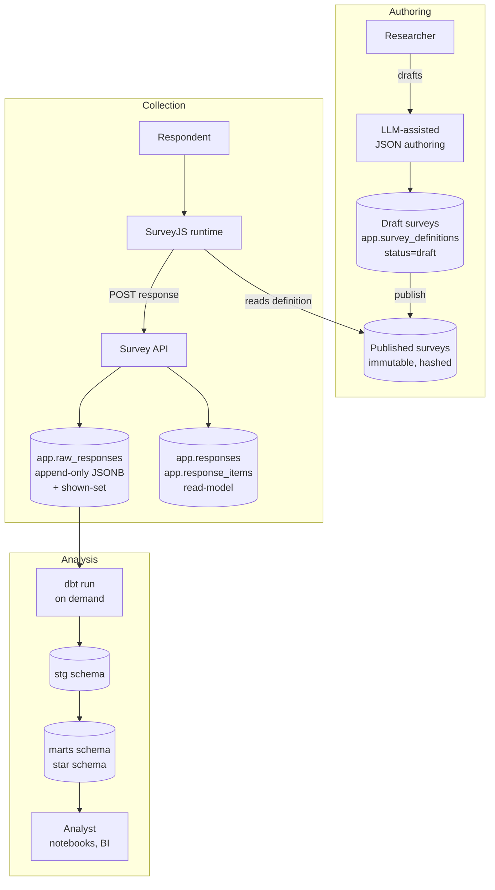
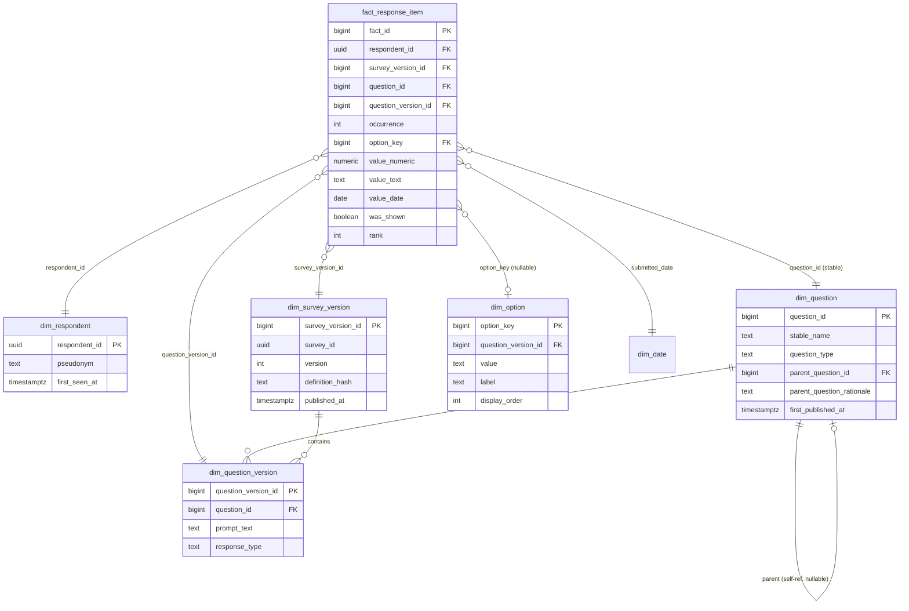
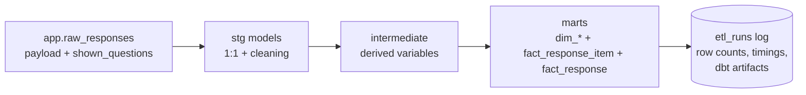

# Survey Engine and Data Warehouse — Engineering Design Document

**Status:** Proposed
**Author:** *(to fill)*
**Last updated:** 2026-05-21

---

## 1. Context

### 1.1 Background

The system supports research conducted via online surveys, with respondents drawn primarily from a tech-worker population. Existing commercial survey platforms handle authoring and collection adequately but produce analytical exports that age poorly: wide tables with versioned column names that fragment across study iterations and that successive analysts interpret inconsistently. Longitudinal studies are particularly vulnerable, because silent question revision is typically discovered too late to untangle.

This document specifies an in-house alternative built from off-the-shelf components, with deliberate boundaries between authoring, collection, and analysis. The system is sized for a side project run by one engineer with research collaborators; it is not a multi-tenant SaaS product.

### 1.2 Audience

Primary readers: the engineer building and operating the system, and the researchers who will author surveys and conduct analyses. Secondary readers: anyone evaluating whether to adopt or extend the system later.

### 1.3 Scope

In scope: survey authoring workflow, response collection and storage, the analytical data model, the transformation pipeline, PII and withdrawal handling, and the operational shape (single Postgres instance, on-demand ETL).

Out of scope: respondent recruitment, IRB processes, statistical methodology, dashboard/BI tool selection beyond the warehouse interface, and authentication architecture for survey distribution (assumed handled by the survey URL distribution mechanism).

### 1.4 Goals

1. Support surveys with complex conditional logic.
2. Preserve longitudinal data integrity across survey revisions.
3. Enable analytical work without coupling it to the operational system.
4. Keep operational complexity proportional to a one-engineer side project.
5. Make methodological judgments (cross-version equivalence, free-text PII risk, missing-vs-routed-past) explicit rather than absorbed by default.

### 1.5 Non-goals

- Real-time analytics or sub-second query latency.
- Replacing a commercial visual survey designer for non-technical authors who require one.
- Supporting respondent populations or compliance regimes beyond GDPR-equivalent.
- Web-scale collection volumes.

### 1.6 Glossary

| Term | Definition |
|---|---|
| Shown-set | The list of question identifiers actually rendered to a respondent during a session, as determined by the SurveyJS engine at runtime. |
| Published version | An immutable, hash-frozen survey definition. Every response references exactly one. |
| Canonical question | The earliest member of an equivalence chain across versions, recorded via `parent_question_id`. |
| Tombstoning | Withdrawal workflow that nulls response content while preserving the audit row. |
| Star schema grain | The atomic unit of a fact table row — here, one option selected per respondent per question occurrence. |

---

## 2. Requirements

### 2.1 Functional requirements

**FR-1. Survey authoring.** Researchers can create, edit, preview, and publish surveys without engineering involvement. LLM-assisted JSON generation from natural-language descriptions is supported. Draft surveys are mutable; published surveys are immutable.

**FR-2. Publish validation.** Publishing a survey runs schema validation, lint checks (duplicate names, dangling `visibleIf` references, duplicate option values, missing matrix row identifiers), and — for surveys flagged for real respondents — a headless round-trip test covering branching paths. Failures block publication.

**FR-3. Versioning.** Each publication produces a new, hash-frozen version. Prior versions persist. Every collected response references the exact version the respondent saw.

**FR-4. Conditional logic.** The runtime supports references to any prior answer (including matrix and panel sub-questions), arithmetic and boolean operators, a function library, and a custom-function escape hatch.

**FR-5. Response capture.** On submission, the system records:
- The full SurveyJS response payload, unmodified.
- The shown-set as reported by the SurveyJS engine.
- A reference to the exact published version (by hash).
- Server timestamp and client metadata.

**FR-6. Routing distinguishability.** Analysts can distinguish three states for any given question:
- Shown and answered.
- Shown and skipped.
- Routed past by conditional logic.

**FR-7. Respondent withdrawal.** A withdrawal workflow exists that nulls response content within the GDPR-mandated window, preserves a withdrawal audit record, and propagates the deletion through the warehouse on the next ETL run.

**FR-8. Free-text PII routing.** Free-text questions default to high-PII-risk storage in a restricted schema. Downgrading a specific question to analyst-accessible storage requires an explicit per-question decision at definition time, with rationale.

**FR-9. Cross-version equivalence (opt-in).** Researchers can declare that a question in a later version is a semantic continuation of an earlier one, with a recorded rationale. Default analytical behavior treats versions as distinct; pooling requires explicit opt-in via a derived canonical key.

**FR-10. Analytical access.** Analysts can query the warehouse via SQL (Postgres), with predictable joins between fact and dimension tables. R via `DBI`/`dbplyr` and Python notebook environments are first-class.

**FR-11. ETL reproducibility.** The full marts schema can be rebuilt from `raw_responses` with a single command. Every ETL run is logged with row counts, timings, and reproducibility metadata.

**FR-12. Edit history.** Response edits create new rows in `raw_responses` rather than updating existing ones. Full submission history is preserved.

### 2.2 Non-functional requirements

**NFR-1. Reproducibility.** Any analytical result must be reconstructible from `raw_responses` alone. The warehouse may be deleted and rebuilt at any time without data loss.

**NFR-2. Auditability.** All transformations are version-controlled SQL with explicit lineage. ETL artifacts (dbt `manifest.json`, `run_results.json`) are archived per run.

**NFR-3. Methodological safety.** Defaults that mask methodological judgments are unacceptable. The system fails closed on ambiguity (e.g., refuses to pool versions silently, defaults free-text to restricted storage).

**NFR-4. Schema portability.** SQL is written in a dialect compatible with both Postgres and DuckDB; dbt models avoid Postgres-only features unless guarded.

**NFR-5. Compliance.** GDPR right-to-erasure must be satisfiable within thirty days. Identifying data is segregated by schema with stricter grants.

**NFR-6. Operational footprint.** The runtime stack is a single Postgres instance plus the SurveyJS frontend. No additional message brokers, search engines, or analytics services are introduced unless triggered by an explicit deferred-decision criterion (§ 5).

**NFR-7. Scale assumptions.** Targets: ≤10 active surveys, ≤10⁴ responses per survey, ≤10⁵ total responses over the system lifetime. Above these volumes the deferred decisions in § 5 are reconsidered.

**NFR-8. Backup and recovery.** Standard Postgres PITR; `raw_responses` immutability ensures full reproducibility from any backup point.

### 2.3 Constraints

- One engineer, part-time. Operational overhead is the binding constraint on architectural complexity.
- Tech-worker respondents may include proprietary information (internal codenames, project details) in free-text fields without explicit awareness.
- Studies are expected to have longitudinal aspirations; the design optimizes for analytical usefulness three years out, not just at first collection.

### 2.4 Assumptions

These are load-bearing and worth surfacing because they are the places the design is most easily wrong:

- **A-1.** LLM-assisted JSON authoring with live preview is comfortable enough for the intended researchers; no visual designer is required initially.
- **A-2.** The SurveyJS engine's shown-set is reliable across edge cases (browser back-navigation, conditional questions toggling mid-session). The retained raw `shown_questions` array allows richer routing dimensions to be backfilled later if not.
- **A-3.** Free-text volume is low enough that a designated reviewer can perform the proprietary-information pass without bottlenecking analysis.
- **A-4.** Strict per-version analysis is the correct default. For psychometric work where reworded items may genuinely measure different constructs, this is methodologically conservative. If most intended analyses turn out to be longitudinal pooled, the default may need inversion.
- **A-5.** Postgres is sufficient at projected scale.

---

## 3. Design

### 3.1 System overview

Three loosely coupled components separated by deliberate boundaries:

1. **Authoring.** Survey design (SurveyJS JSON, draft mode, publish gates).
2. **Collection.** Response capture and storage (append-only `raw_responses` plus rebuildable read-model).
3. **Analysis.** Dimensional warehouse, dbt-managed transformations, SQL access.

Collected data is stored in a form independent of how surveys were authored and independent of how analytical tools consume it. Each component can be replaced, debugged, or reasoned about without affecting the others.



### 3.2 Component selection

| Component | Choice | Rationale |
|---|---|---|
| Survey runtime | SurveyJS (`survey-core`, MIT) | JSON-driven, capable conditional-logic engine, structured-text introspection. |
| Database | PostgreSQL | Single instance serves operational and analytical loads at research scale. |
| Transformation | dbt (`dbt-postgres`) | Version-controlled, tested, documented SQL with lineage. Adapter abstraction preserves DuckDB migration path. |
| Visual designer | Deferred | LLM-assisted JSON authoring used initially. SurveyJS Creator commercial license available as fallback. |

### 3.3 Schema layout

The database is organized into four schemas with distinct roles and grants:

| Schema | Purpose | Writer |
|---|---|---|
| `app` | Operational tables. Transactional integrity guarantees apply. | Survey API |
| `stg` | dbt staging models. 1:1 with operational tables, light cleaning and type casting. | ETL |
| `marts` | Dimensional model and derived variables. Analyst-facing. | ETL |
| `pii` | Identifying respondent data. Stricter grants. | Survey API, reviewer |

Database roles are scoped per schema with least-privilege grants. The survey API role writes only to `app` and `pii`. The ETL role reads from `app` and writes to `stg` and `marts`. The analyst role reads from `marts` only.

### 3.4 Operational data model (`app`)

#### `survey_definitions`

Holds both draft and published survey definitions. A draft is mutable; publish freezes it.

| Column | Notes |
|---|---|
| `survey_id` | Stable identifier across versions |
| `version` | Monotonic per `survey_id`; only published versions are referenced by responses |
| `definition_json` | The full SurveyJS JSON |
| `definition_hash` | SHA-256 of the canonical JSON; used to detect drift |
| `status` | `draft` or `published` |
| `published_at` | Null until publish |

#### `raw_responses`

Append-only audit log. **Sole source of truth for ETL.**

| Column | Notes |
|---|---|
| `id` | bigserial primary key |
| `respondent_id` | UUID, links to respondent (PII held separately) |
| `survey_id`, `survey_version` | Identifies the exact published definition answered |
| `submitted_at` | Server timestamp |
| `payload` | Raw SurveyJS response JSON (jsonb) |
| `shown_questions` | jsonb array of `question_id`s actually rendered; written by the API at submission time from the SurveyJS engine's own visibility state |
| `client_metadata` | User agent, locale, etc. (jsonb) |
| `definition_snapshot` | jsonb. Frozen copy of the published definition (the SurveyJS JSON plus its `definition_hash` and `published_at`) the response was answered against. Written by the API at submission time. |

Edits create new rows, never updates. The `shown_questions` field is the key to routing fidelity — capturing visibility at submission time, from the engine that made the decisions, eliminates the need to reconstruct routing in SQL later.

The `definition_snapshot` is what lets the warehouse build its dimensions (`dim_question`, `dim_option`, `dim_survey_version`, …) while reading `raw_responses` and nothing else — preserving the single-source/reproducibility guarantee (NFR-1) without dbt reaching into `app.survey_definitions`. Because published definitions are immutable (invariant 2), the snapshot can never drift from the version answered. It is nullable, like `payload`/`shown_questions`/`client_metadata`, so the withdrawal/tombstone workflow (§3.8) can null it alongside the other content columns.

Storing the full definition on every response is deliberately redundant — the same snapshot repeats across all responses to a given version. The trade is intentional: it keeps `raw_responses` the single, self-contained ETL source (operational simplicity over storage), which is the binding constraint at research scale. jsonb TOAST compression keeps the on-disk cost modest.

#### `responses` and `response_items`

Normalized form of the raw payload, populated by the API at submission time. These support operational queries (e.g., "has this respondent completed survey X") and are **rebuildable from `raw_responses` at any time**. They are explicitly not an ETL input — dbt reads from `raw_responses` only — which keeps the system to a single JSON parser and avoids the two-parsers-drifting-apart failure mode.

### 3.5 Warehouse model (`marts`)

A Kimball-style star schema. Fact-table grain is one row per option selected:

> **(respondent, survey_version, question_id, occurrence, selected_option)**

This grain handles single-select, multi-select, ranked, matrix, and repeating-group questions uniformly. Multi-select fans out to multiple rows; single-select is one row with the chosen option.

A companion `fact_response` table at respondent-question grain supports analyses needing "did this respondent answer this question" semantics without fanning across options. It carries no value columns; it exists to give cardinality questions a physical home distinct from the selection-grain fact and to prevent silent confusion between selection counts and respondent counts.

#### Dimensions



#### Value storage

Closed-ended responses resolve via an `option_key` join. Open-ended responses use a slim polymorphic column set: `value_numeric`, `value_text`, `value_date`. Exactly one is populated per fact row, governed by the question's response type. Strong typing for BI tools without the cost of a fully wide schema.

#### Routing fidelity

`was_shown` on the fact row is populated directly from the API-captured `shown_questions` set. No SQL-side expression evaluation. The boolean distinguishes:

- Shown and answered: `was_shown = true`, value populated.
- Shown and skipped: `was_shown = true`, value null.
- Routed past: `was_shown = false`, value null.

#### Cross-version equivalence

Questions are not treated as equivalent across versions by default. Each `dim_question_version` is its own thing; naive `GROUP BY question_id` gives strict per-version behavior.

For explicit equivalence judgments, `dim_question` carries two nullable columns:

| Column | Notes |
|---|---|
| `parent_question_id` | Self-referential FK. Flat: points to the canonical (earliest) question, not the immediate predecessor. Almost always null. |
| `parent_question_rationale` | Free text. Required whenever `parent_question_id` is populated. The judgment is more valuable than the link. |

A check constraint enforces that the parent's `first_published_at` precedes the child's, preventing circular or future-pointing parents.

Both columns live on `dim_question` (the stable abstraction), not `dim_question_version` (specific renderings), because the equivalence judgment is about the questions as constructs.

The canonical pooling key for cross-version analysis is:

```sql
COALESCE(parent_question_id, question_id) AS canonical_question_id
```

Analysts wanting strict per-version behavior ignore the columns. Analysts wanting to pool must opt in by using `canonical_question_id`, which is the moment of friction that prompts them to check the rationale and confirm pooling is appropriate.

#### Indexes

- `(survey_version_id, question_id)` — per-question aggregations within a version.
- `(respondent_id, survey_version_id)` — respondent-level retrieval.
- `(question_id, option_key)` — cross-version option aggregations.
- Covering index on `(question_id, value_numeric)` for scale-score aggregations.

### 3.6 Authoring workflow

1. Researcher creates a new draft (or clones an existing published survey into a draft).
2. Edits via a draft-mode UI: paste JSON, edit fields, preview live in the SurveyJS runtime, self-test as respondent.
3. LLM assistance generates and refines JSON from natural-language descriptions; a pattern library in the repo serves as both researcher reference and LLM context.
4. **Publish** runs validation gates and, on success, freezes the definition.

Gates:

- Schema validation against the SurveyJS JSON schema.
- Lint checks: duplicate question names, dangling `visibleIf` references, duplicate option values, missing matrix row identifiers.
- Round-trip test (for surveys flagged as going to real respondents): headless run with synthetic respondents covering branches; response payload matches expectations.
- Hash and freeze.

Principle: **immutability matters at publish time, not at author time.** Drafts are throwaway and feel that way. Published surveys are forever and are treated that way.

```mermaid
sequenceDiagram
    participant R as Researcher
    participant D as app.survey_definitions
    participant API as Survey API
    participant Resp as Respondent

    R->>D: Create draft (status=draft)
    R->>D: Edit freely
    R->>D: Publish → hash JSON, status=published, immutable

    Resp->>API: GET survey
    API->>D: Read published version
    API->>Resp: Render survey

    Resp->>API: Submit response (payload + shown-set)
    API->>API: Store raw payload + shown_questions + survey_version reference

    R->>D: Need a change? Clone published → new draft
    Note over R,D: Old version remains; new version gets new hash
```

### 3.7 ETL

dbt runs on demand. One command (`make etl` or equivalent) rebuilds the marts schema from scratch. Full rebuild is preferred over incremental until rebuild time becomes painful.

dbt reads exclusively from `app.raw_responses`. The normalized `app.responses` and `app.response_items` tables are an operational read-model and are not ETL inputs.



Routing reconstruction is not an intermediate model — the shown-set is captured at submission time and threads through staging directly to `was_shown`.

#### Materialization

- Staging models: views (cheap, thin transformations).
- Intermediate and marts: tables (analytical query performance).
- Materialized views: not used (dbt-managed tables are simpler to reason about).

#### Testing

dbt built-ins:

- `unique` on surrogate keys.
- `not_null` on required columns.
- `relationships` between facts and dimensions.

Custom tests:

- Row-count parity between raw JSON option selections and fact rows.
- Version coverage: every `(respondent_id, survey_version_id)` pair in `app.raw_responses` has corresponding fact rows.
- Polymorphic value invariant: for each fact row, exactly one of `{option_key, value_numeric, value_text, value_date}` is populated, matching the question's response type.
- Parent-question integrity: any populated `parent_question_id` has a non-null `parent_question_rationale` and a `first_published_at` strictly before the child's.
- Shown-set integrity: every `question_id` referenced in a fact row with `was_shown = true` appears in the corresponding submission's `shown_questions`.

#### Run logging

An `etl_runs` table records every invocation:

| Column | Notes |
|---|---|
| `run_id` | UUID |
| `started_at`, `completed_at`, `status` | Timing and outcome |
| `source_row_counts` | jsonb: rows per source table at run start |
| `mart_row_counts` | jsonb: rows per marts table after run |
| `dbt_version`, `git_sha` | Reproducibility metadata |

dbt's `run_results.json` and `manifest.json` artifacts are archived alongside.

### 3.8 Respondent withdrawal

Append-only audit semantics and GDPR right-to-erasure are reconciled via an explicit tombstoning workflow:

1. **Withdrawal request recorded** in `pii.withdrawals` with `respondent_id` and timestamp.
2. **Raw payload tombstoned**: `payload`, `shown_questions`, and `client_metadata` are nulled on the relevant rows in `raw_responses`. The row itself remains so the audit log is structurally complete; no response content survives.
3. **Read-model purged**: `app.responses` and `app.response_items` rows for the respondent are deleted (rebuildable, so safe).
4. **Marts rebuilt** on next dbt run; with tombstoned source rows, no fact rows are emitted for the withdrawn respondent.
5. **PII deleted** from `pii.*` tables per the standard process.

The withdrawal record itself is retained as evidence that the deletion occurred. Designing this up front avoids the retrofit work that derails research projects mid-flight.

### 3.9 Free-text routing and PII

Tech-worker respondents are particularly likely to include proprietary content in free-text fields without explicit awareness. The schema treats free-text values as PII-adjacent by default:

- Questions are tagged at definition time with a `pii_risk` flag (`low` / `high`).
- `value_text` in `marts.fact_response_item` is populated **only** for `low`-risk free-text questions.
- `high`-risk free-text values are stored in `pii.free_text_responses` keyed by submission, accessible only to the PII-cleared role; the fact row carries a null `value_text` and a `value_text_redacted = true` indicator.

The default for any free-text question is `high` unless the researcher explicitly downgrades it at definition time with a brief justification. The safe path is the default; the risky path requires a deliberate decision.

A designated reviewer can promote individual `high`-risk responses to the analytical marts after a brief screening pass, consolidating the "is this PII" and "does this contain proprietary information" determinations into a single human-in-the-loop checkpoint. If response volume exceeds reviewer capacity, automated PII detection as a first pass may be required.

---

## 4. Alternatives considered

### 4.1 Commercial survey platform with wide-table exports

**Rejected.** Wide-table exports encode structural choices in column-naming conventions (`q3_v2_opt_a`) that fragment under versioning and that successive analysts interpret inconsistently. Longitudinal integrity depends on out-of-band documentation that drifts from reality. Adequate for one-off cross-sectional studies, inadequate for the longitudinal goals here.

### 4.2 SurveyJS Creator (visual designer) at the outset

**Deferred.** A commercial license adds cost and obscures the JSON. LLM-assisted JSON authoring with live preview is the initial bet; the Creator remains available as a fallback if non-technical authoring patterns emerge that the JSON workflow does not serve. Revisitable.

### 4.3 Separate operational and analytical databases from day one

**Rejected for now.** A single Postgres instance serves both loads at projected scale and halves the operational footprint. The architecture is designed so migration to a dedicated analytical engine (DuckDB) is primarily a configuration change rather than a rewrite. The choice is deferred until empirical pressure makes it necessary.

### 4.4 DuckDB instead of Postgres

**Deferred, not rejected.** DuckDB is the planned destination if query latency, snapshot distribution, or open-data publication eventually require it: same SQL surface, embeddable deployment, first-class Parquet support, enabling collaborators to receive a `.parquet` file and run analyses without standing up a database. The dbt transformations are written with this migration path preserved. No migration is committed.

### 4.5 SQL-side reconstruction of conditional routing from `visibleIf` expressions

**Rejected.** Re-evaluating SurveyJS expression-language constructs in SQL is fragile and a perpetual source of divergence between what the engine actually showed and what the warehouse believes was shown. Capturing the shown-set at submission time, from the engine that made the routing decisions, is the only reliable approach. The raw `shown_questions` array is retained on every submission so richer routing dimensions can be backfilled without re-collection.

### 4.6 Wide polymorphic value schema (separate fact tables per response type)

**Rejected.** Multiplies the number of fact tables and the complexity of cross-type queries. The slim polymorphic column set (`value_numeric`, `value_text`, `value_date`) with a per-row invariant enforced via dbt test keeps strong typing without the cardinality explosion.

### 4.7 Single fact table at respondent-question grain only

**Rejected.** Loses option-level cardinality for multi-select and matrix questions. The chosen design uses both: `fact_response_item` at option-selection grain plus a companion `fact_response` at respondent-question grain, which prevents the common analytical mistake of conflating selection counts with respondent counts.

### 4.8 Auto-pooling questions across versions based on stable name or text similarity

**Rejected.** Whether a reworded item measures the same construct is a methodological judgment, not a system inference. Auto-pooling would absorb the judgment into a default and produce silently inconsistent longitudinal analyses. The explicit opt-in via `parent_question_id` plus rationale is a deliberate friction point.

### 4.9 Soft-delete (status flag) for respondent withdrawal

**Rejected.** GDPR right-to-erasure requires content deletion, not just hiding. The tombstoning workflow nulls content while preserving the audit row, satisfying both obligations.

---

## 5. Deferred decisions

These are reopened when explicit triggers are met, not on a schedule.

| Decision | Trigger |
|---|---|
| DuckDB migration | Analytical query latency, snapshot distribution needs, or collaborator workflow requirements. |
| Scheduled ETL (cron → GitHub Actions → Dagster) | When on-demand becomes inadequate. |
| Incremental dbt materializations | When full-rebuild time exceeds a few minutes, or when single-respondent backfill becomes a frequent need. |
| SurveyJS Creator license | Non-technical authoring patterns the LLM-assisted JSON workflow doesn't serve well. |
| Full routing-trace dimension | Research questions requiring reconstruction of the decision graph beyond what `was_shown` + raw `shown_questions` arrays support. (Backfillable without re-collection.) |
| Automated PII detection as first pass on free-text | Free-text volume exceeding reviewer capacity. |

---

## 6. Risks and mitigations

| Risk | Mitigation |
|---|---|
| Survey definition drift between client and stored hash | API validates submitted `survey_version` matches a known published hash; rejects otherwise. |
| Question rename treated as same question | Stable `question_id` established at first publication and never reused; renames surfaced in lint. |
| Analyst silently pools questions across versions that aren't equivalent | Pooling requires explicit `canonical_question_id`; default `GROUP BY question_id` gives strict per-version behavior. |
| LLM-generated JSON with subtle logic errors | Round-trip test gate at publish time; pattern library reduces invention surface. |
| Two parsers (API and dbt) drift apart over time | dbt reads from `raw_responses` only; normalized tables are a read-model, not an ETL input. |
| Analyst confuses "selection count" with "respondent count" | Companion `fact_response` table at respondent-question grain; documented in marts; default examples use `COUNT(DISTINCT respondent_id)`. |
| Free-text answers leak PII into analyst-accessible marts | High-PII-risk default for free-text; downgrade requires explicit per-question decision at definition time. |
| Free-text leaks proprietary information not classified as PII | Reviewer pass on `high`-risk responses before promotion to marts; consolidates PII and proprietary screening into a single checkpoint. |
| Respondent withdrawal request hits append-only audit log | Designed tombstone workflow: nulled payload, retained row, rebuildable downstream. |
| PostgreSQL hits analytical performance ceiling | DuckDB migration path preserved via dbt adapter abstraction and SQL-dialect discipline. |
| Single-instance Postgres failure | Standard backup and PITR practice; `raw_responses` immutability ensures full reproducibility from backup. |
| Shown-set capture incorrect at edge cases (browser back-navigation, conditional toggling mid-session) | Raw `shown_questions` array retained on every submission; richer routing dimensions backfillable without re-collection. |
| Strict per-version default proves wrong for majority of analyses | `canonical_question_id` and the rationale column let pooling be adopted retroactively; the inversion costs ergonomics, not data. |

---

## 7. Open questions

Inputs that materially shape the design and that should be settled before or shortly after implementation begins:

1. **Volume and cadence.** Surveys per year, respondents per survey, single ongoing instrument with versioning versus multiple distinct studies.
2. **Longitudinal scope.** Repeated measurement of the same respondents over time versus primarily cross-sectional snapshots.
3. **Collaborator profile.** Whether additional researchers — with or without engineering background — will need to author surveys or conduct analyses. This affects the visual-designer question and the access-control model.
4. **Open data intent.** Plans (if any) to publish anonymized datasets. The marts schema must be designed with that target in mind from the outset; pseudonymization alone is insufficient when response patterns are themselves re-identification vectors.
5. **Free-text volume.** Expected open-ended content per survey and realistic reviewer capacity.
6. **Scope reduction.** Which proposed components feel disproportionate to the actual study constraints. The proposal is maximalist; most projects should not adopt all of it. The appropriate shape emerges from the answers above.

---

## 8. Summary

A single PostgreSQL instance, SurveyJS for the runtime, dbt for transformations, and a star schema with option-grain facts plus a respondent-question companion fact. Raw response payloads stored append-only — with the API-captured shown-set alongside the payload — as the sole ETL source of truth. Normalized operational tables are a rebuildable read-model. Survey definitions immutable at publish time, draft-mode editing for low-friction authoring. Questions are not pooled across versions by default; an explicit `parent_question_id` + rationale pair provides an auditable home for the rare equivalence judgments. Respondent withdrawal and PII-bearing free-text are designed workflows rather than afterthoughts. On-demand ETL until scheduling is genuinely needed. DuckDB and other scaling moves available as deferred options.
